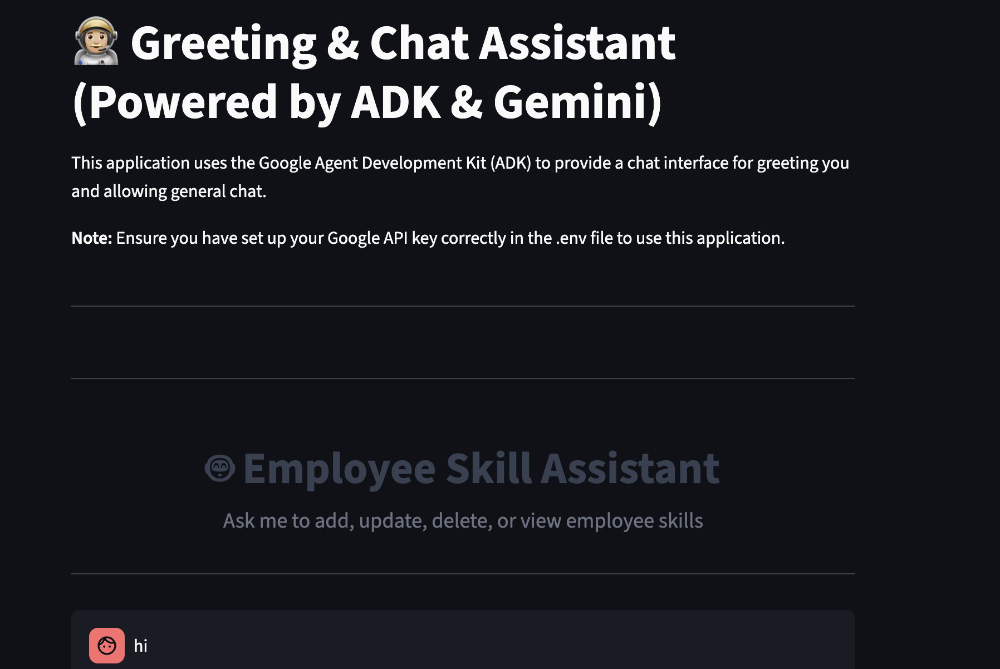

# 🤖 Employee Skill Assistant (Streamlit + Google ADK + Postgres)

This app is a smart chat interface powered by **Google Agent Development Kit (ADK)** and **Gemini 2.5**. It lets you add, update, delete, or view employee data (including tech stacks and experience) using natural language queries — no coding needed!

---

## 📸 Demo

  
*Ask it things like:*  
- `"Add John who knows React (2 years) and Python (1 year)"`
- `"Update John's React experience to 3 years"`
- `"Delete employee John"`
- `"Show all employee data"`

---

## 🧠 Features

- 🗣 Natural language control via Gemini
- 🧩 Uses Google ADK with custom tool (`run_sql_query`)
- 🛢 PostgreSQL for employee data storage
- 🎨 Streamlit-based UI with chat + data table
- 📦 Modular Python structure (separates agent, DB, and UI logic)

---

## 📁 Folder Structure

```

employee\_skill\_assistant/
├── .env                     # Environment variables
├── README.md
├── app.py                   # Streamlit UI app
├── agent.py                 # Agent + run\_sql\_query tool
├── db.py                    # PostgreSQL connection helper
├── create\_tables.py         # Creates employee tables in DB
├── requirements.txt

````

---

## ⚙️ Prerequisites

1. **Python 3.9+**
2. **PostgreSQL installed & running**
3. A **Gemini API Key** from Google AI Studio

---

## 🧪 Installation & Setup

### 1. 🔁 Clone the Repo

```bash
git clone https://github.com/YOUR_USERNAME/employee_skill_assistant.git
cd employee_skill_assistant
````

---

### 2. 🐍 Create Virtual Environment

```bash
python -m venv .venv
source .venv/bin/activate  # On Windows: .venv\Scripts\activate
```

---

### 3. 📦 Install Dependencies

```bash
pip install -r requirements.txt
```

---

### 4. 🔐 Configure Environment Variables

Create a `.env` file in the root directory:

```env
# .env
GOOGLE_GENAI_USE_VERTEXAI=FALSE
GOOGLE_API_KEY=your_gemini_api_key_here

POSTGRES_HOST=localhost
POSTGRES_PORT=5432
POSTGRES_DB=employee_db
POSTGRES_USER=your_db_user
POSTGRES_PASSWORD=your_db_password
```

---

### 5. 🏗️ Create the Database Tables

Ensure PostgreSQL is running, then run:

```bash
python create_tables.py
```

This will create:

* `employees(id SERIAL PRIMARY KEY, name TEXT NOT NULL)`
* `employee_skills(id SERIAL PRIMARY KEY, employee_id INT REFERENCES employees(id), tech TEXT NOT NULL, experience_years NUMERIC NOT NULL)`

---

### 6. 🚀 Start the App

```bash
streamlit run app.py
```

The app will open in your browser. Chat with it directly!

---

## 💬 Sample Prompts

> ✅ These all work as natural language prompts:

| Action          | Example Prompt                                        |
| --------------- | ----------------------------------------------------- |
| Add employee    | `Add Alice with 3 years in Node.js and 1 year in SQL` |
| View all        | `Show me all employee data`                           |
| Update stack    | `Change Alice's Node.js experience to 4 years`        |
| Delete employee | `Remove Alice from the system`                        |

---

## 🧠 How It Works

### Agent Instruction

A powerful `LlmAgent` is configured with this instruction:

> “Use only `run_sql_query()` to insert, update, delete or query employee and skills data from the PostgreSQL DB. Fetch `employee_id` when needed. Never assume data — ask the user to clarify.”

### run\_sql\_query Tool

```python
def run_sql_query(tool_context, query: str) -> Dict:
    # Executes SELECT / INSERT / UPDATE / DELETE SQL
```

It uses `psycopg2` and converts any `Decimal` values to `float` to ensure JSON safety.

---

## 🐛 Common Errors

| Error                                             | Fix                                                             |
| ------------------------------------------------- | --------------------------------------------------------------- |
| `Object of type Decimal is not JSON serializable` | Fixed by converting `Decimal → float` in query results          |
| `cursor is not a context manager`                 | Use `with conn.cursor() as cur:` not `with conn.cursor as cur:` |
| `Session not found`                               | Restart Streamlit to reinitialize the ADK session               |
| `KeyError` on env                                 | Double-check `.env` is created and `load_dotenv()` is called    |

---

## ✨ Optional Enhancements

* [ ] Add login/authentication
* [ ] Store query logs
* [ ] Export results to CSV
* [ ] Deploy with Docker

---

## 🤝 Credits

* [Google Agent Development Kit (ADK)](https://google.github.io/adk-docs/)
* [Gemini 2.5](https://ai.google.dev/)
* [Streamlit](https://streamlit.io/)
* [PostgreSQL](https://www.postgresql.org/)
* Inspired by developer @ketanraj's ADK experiments 🚀

---

